# LCD I2C Demo

Project demo giao tiếp Verilog với LCD qua giao thức I2C

## I. Tác giả

- **Name:** Võ Nhật Trường
- **Email:** truong92cdv@gmail.com
- **GitHub:** [truong92cdv](https://github.com/truong92cdv)

## II. Kết quả demo

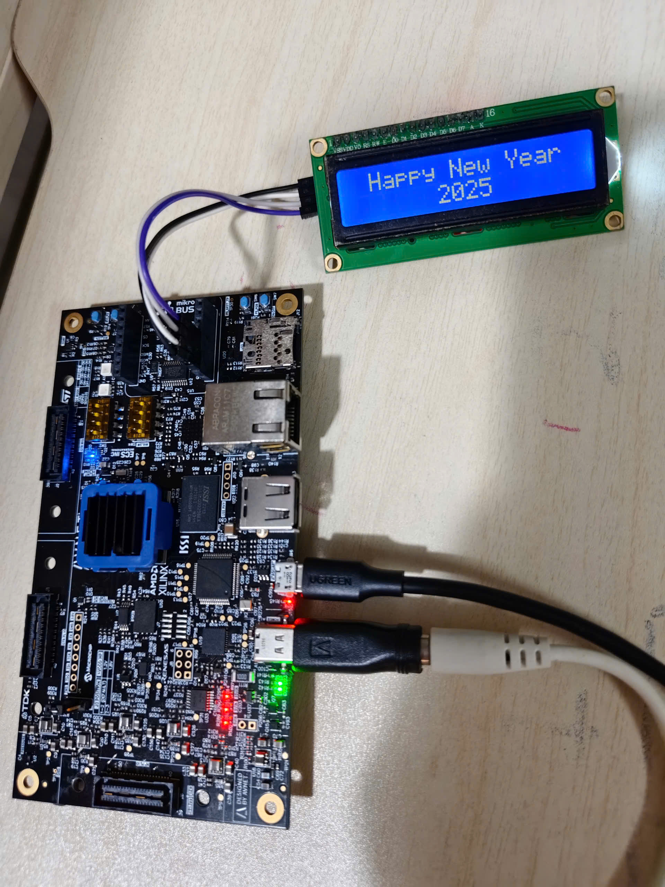

## III. Thiết bị

- ZUBoard 1cg mã sản phẩm XCZU1CG-1SBVA484E
- LCD I2C module 16x2 (có tích hợp ic **PCF8574** với địa chỉ i2c là 0x27).
- 2 đường dây nối SDA và SCL, dây VCC +5V, dây GND.

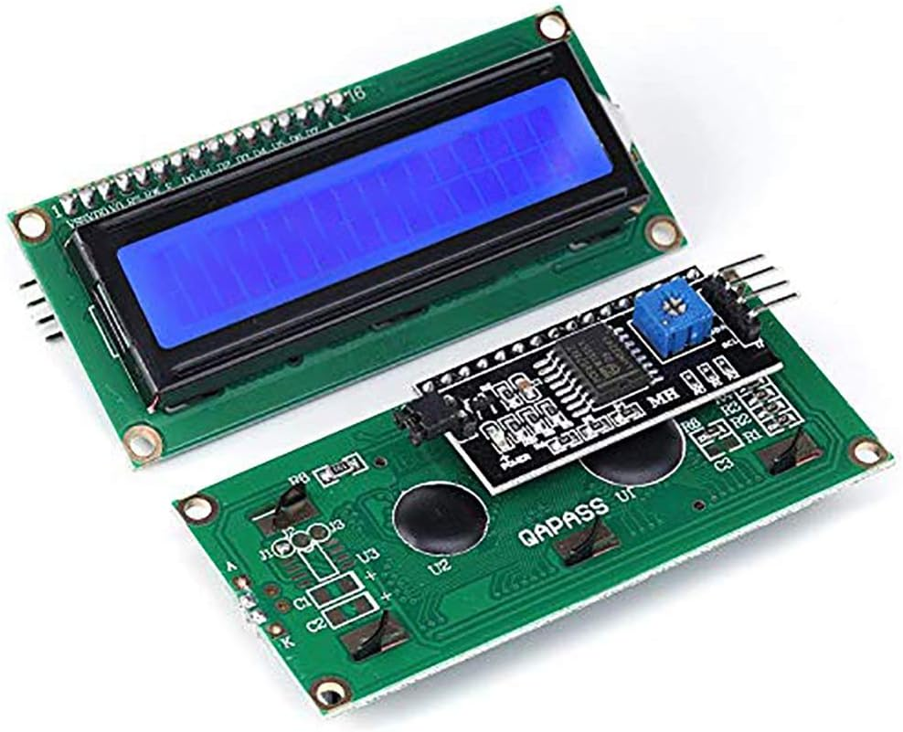

## IV. I2C protocol

Đọc thêm về giao thức I2C tại đây [I2C protocol](https://dayhocstem.com/blog/2020/05/giao-dien-ghep-noi-i2c.html).

Giao thức I2C gồm 2 đường tín hiệu: SDA và SCL. Tín hiệu SCL là tín hiệu xung clock do thiết bị Master tạo nhịp, tín hiệu SDA là dữ liệu truyền đi.
Khi Master muốn ghi dữ liệu vào Slave, sẽ trải qua các bước sau:
1. Master gửi tín hiệu **START** (kéo SDA từ high -> low khi SCL đang giữ mức high).
2. Master gửi địa chỉ Slave cần ghi (frame 8 bit gồm 7 bit addr + bit 0 để chỉ định write).
3. Slave so sánh địa chỉ, nếu trùng khớp, nó sẽ gửi tín hiệu **ACK** để sẵn sàng nhận dữ liệu từ Master (giữ SDA ở mức low khi SCL từ low -> high ở xung nhịp thứ 9).
4. Master gửi 1 byte data. Ghi từng bit vào SDA (MSB first) khi SCL chuyển từ low -> high.
5. Slave gửi tín hiệu **ACK**. Lặp lại bước 4 và 5 đến khi Master đã truyền xong dữ liệu.
6. Master gửi tín hiệu **STOP** (kéo SDA từ low -> high khi SCL đang giữ mức high).

Nên nhớ rằng đường tín hiệu SDA và SCL là 2 chiều, và phải được nối với điện trở pull-up (thường dùng 4.7k) để tránh xung đột tín hiệu. Khi Master hoặc Slave muốn kéo tín hiệu xuống low, nó phải gửi tín hiệu low. Còn khi muốn kéo tín hiệu lên high, chỉ cần giải phóng đường tín hiệu để pull-up register làm nhiệm vụ kéo đường tín hiệu lên high.

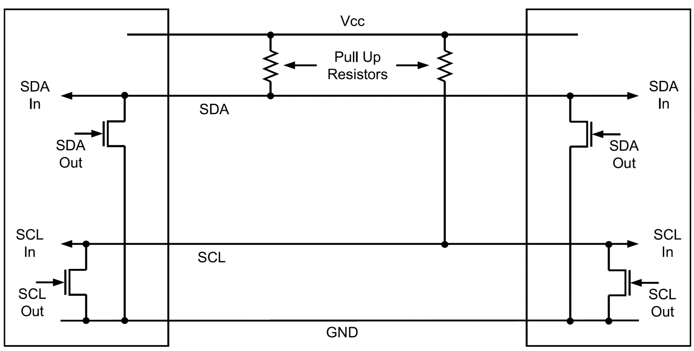

Giao thức truyền nhận dữ liệu khi Master muốn ghi dữ liệu vào Slave:

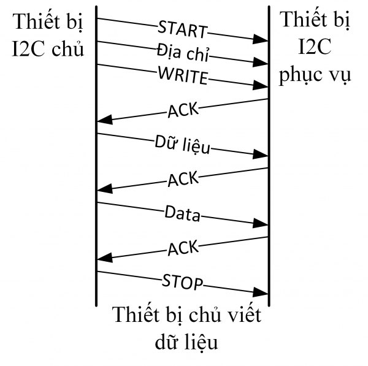

Waveform mục tiêu cần đạt:

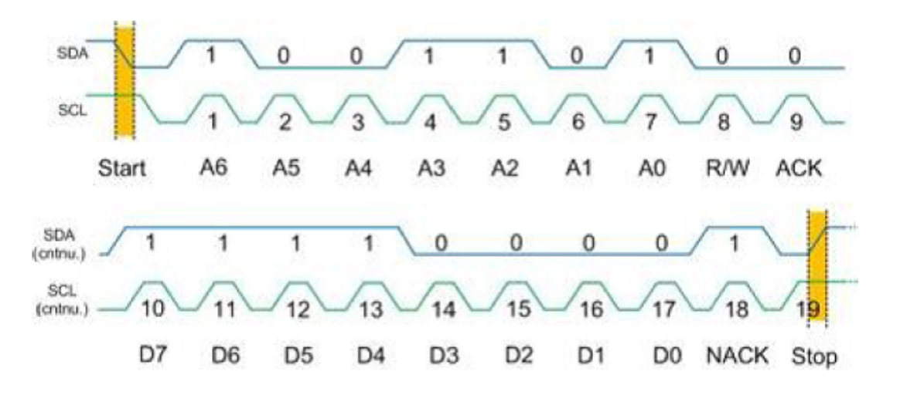

## V. Source code

### [1. clk_divider](./src/clk_divider.v)

---

- Tạo clk 1 MHz (1 us) từ clk 100 MHz của ZUBoard.

### [2. i2c_writeframe](./src/i2c_writeframe.v)

---

- Đầu tiên, thiết kế module **i2c_writeframe** để ghi 1 frame (địa chỉ hoặc dữ liệu).


- Cờ **start_frame** và **stop_frame** để báo hiệu frame hiện tại là frame đầu tiên (frame địa chỉ, thêm tín hiệu **START** ở đầu frame) hay frame cuối cùng (thêm tín hiệu **STOP** ở cuối frame).

- Tín hiệu SDA là 2 chiều, cần phải được khai báo theo kiểu **tri-state buffer**, kích hoạt bởi tín hiệu **sda_en**.

```
    // sda is a bidirectional tri-state buffer enabled by sda_en.
    // When sda_en = 1; if sda_out = 0, sda = 0; if sda_out = 1, sda is high impedance, allowing pull-up resistor pulls sda to 1.
    // When sda_en = 0; sda is high impedance, allowing read sda from the bus.
    assign sda = sda_en ? (~sda_out ? 1'b0 : 1'bz) : 1'bz;
    assign sda_in = sda;
```

- Khi viết testbench thử nghiệm, sửa đoạn code trên lại 1 tí để hiện waveform cho dễ nhìn:

```
    // for simulation, we use those lines instead:
    assign sda = sda_en ? sda_out : 1'bz;
    assign sda_in = sda;
```

- Module **i2c_writeframe** là 1 **FSM** gồm 15 states, mục tiêu nhằm tạo được 1 khung truyền hoàn chỉnh như sau:

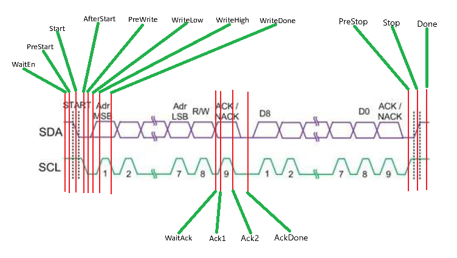

Flowchart của i2c_writeframe FSM

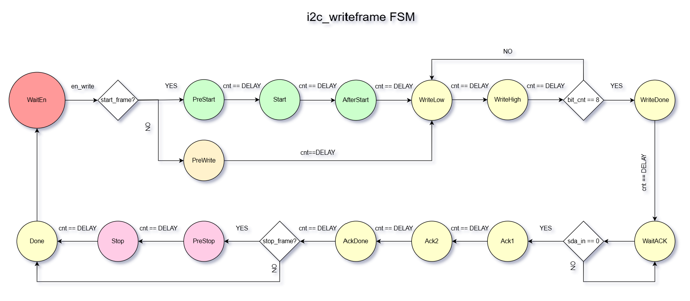

- Các trạng trái **PreStart**, **Start**, **AfterStart** chỉ xuất hiện khi cờ **start_frame** được set.
- Tương tự, các trạng thái **PreStop** và **Stop** chỉ xuất hiện khi cờ **stop_frame** được set.
- 2 trạng thái **WriteLow** và **WriteHigh** lặp lại 8 lần (1 khung truyền 8 bit).

[Testbench code](./tb/i2c_writeframe_tb.v)

Testbench waveform:

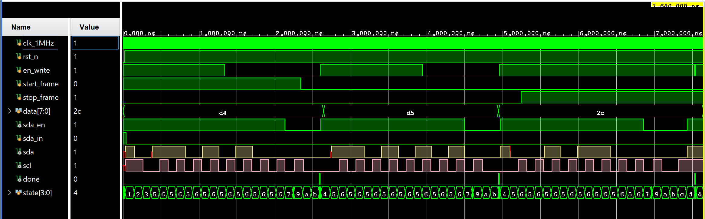

Để ý rằng frame đầu tiên có điều kiện **START** và frame cuối cùng có điều kiện **STOP**.

### [3. lcd_write_cmd_data](./src/lcd_write_cmd_data.v)

---

- module này nhằm gửi lệnh hoặc dữ liệu đến LCD theo chế độ 4 bit.

- Đọc thêm về giao tiếp LCD chế độ 4 bit ở đây [LCD 4bit mode](https://www.electronicwings.com/8051/lcd16x2-interfacing-in-4-bit-mode-with-8051).

Trước khi gửi dữ liệu đến LCD, cần gửi các lệnh khởi tạo chế độ ghi 4 bit:
1. Lệnh **0x02**: set 4 bit mode.
2. Lệnh **0x28**: set LCD 16x2, 4 bit mode, 2 dòng, ký tự dạng 5x8.
3. Lệnh **0x0C**: set Display ON, tắt con trỏ.
4. Lệnh **0x06**: tự động tăng con trỏ khi ghi xong 1 ký tự.
5. Lệnh **0x01**: xóa màn hình
6. Lệnh **0x80**: Đưa con trỏ về đầu dòng 1.

Các bước để gửi 1 lệnh hoặc dữ liệu bao gồm:
1. Set **RS = 0** (gửi lệnh) hoặc **RS = 1** (gửi dữ liệu).
2. Set **RW = 0** (chế độ ghi).
3. Gửi 4 bit cao đến các chân **D7 D6 D5 D4** của LCD.
4. Gửi 1 xung High -> Low đến chân **EN** của LCD để chốt dữ liệu.
5. Gửi 4 bit thấp đến các chân **D7 D6 D5 D4** của LCD.
6. Gửi 1 xung High -> Low đến chân **EN** của LCD để chốt dữ liệu.

Vì ta gửi lệnh (hoặc dữ liệu) cho LCD qua ic PCF8574. Ta cần nắm được sơ đồ kết nối của module LCD I2C (gồm ic PCF8574):

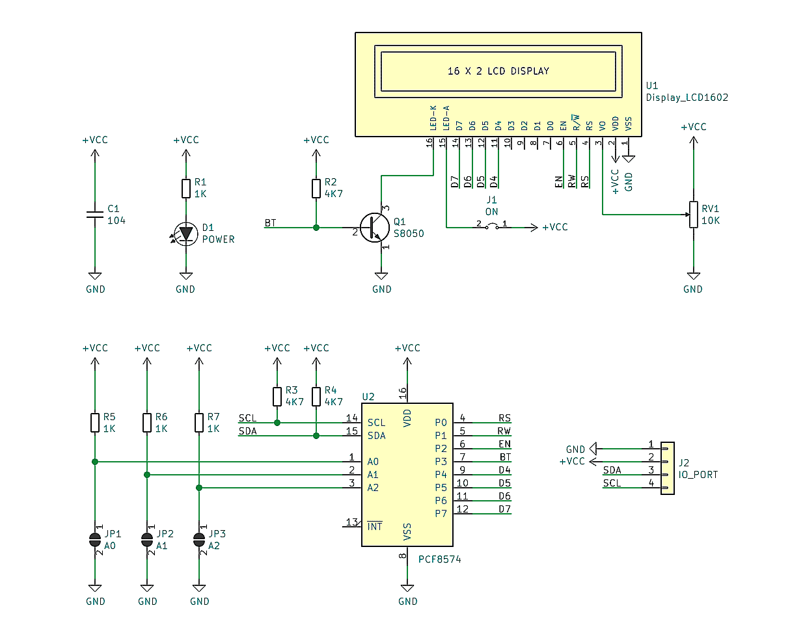

Khi gửi 1 byte đến PCF8574, dữ liệu sẽ được xuất ra các chân tương ứng:

- **P7  P6  P5  P4  P3  P2  P1  P0** (đầu ra PCF8574)
- **D7 D6 D5 D4 BT EN RW RS** (chân LCD tương ứng)

Để gửi 1 lệnh (hoặc dữ liệu) cho LCD theo chế độ 4 bit ta cần gửi 5 frames:
1. Set cờ **start_frame**. Gửi frame địa chỉ (gồm 7 bit địa chỉ + bit 0 - write).
2. Gửi data frame 1 gồm (**D7 D6 D5 D4 1 1 0 RS**).
3. Gửi data frame 2 gồm (**D7 D5 D4 D4 1 0 0 RS**). Lúc này ta đã tạo 1 xung **EN** từ high -> low để chốt dữ liệu 4 bit cao.
4. Gửi data frame 3 gồm (**D3 D2 D1 D0 1 1 0 RS**).
5. Set cờ **stop_frame**. Gửi data frame 4 gồm (**D3 D2 D1 D0 1 0 0 RS**). Lúc này ta đã tạo xung **EN** thứ 2 để chốt dữ liệu 4 bit thấp.

Module **lcd_write_cmd_data** là 1 **FSM** gồm 14 states, nhằm thực hiện các bước trên.

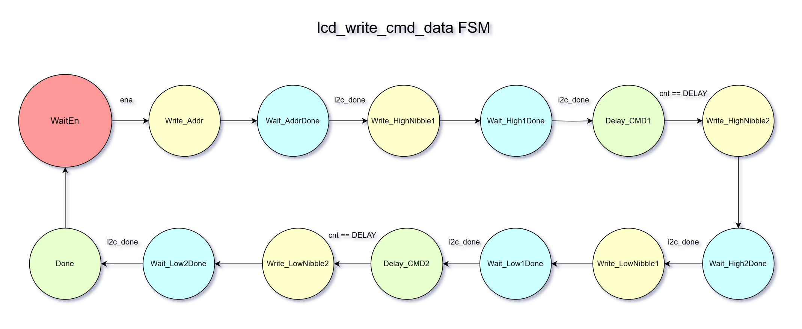

[Testbench code](./tb/lcd_write_cmd_data_tb.v)

Testbench waveform:

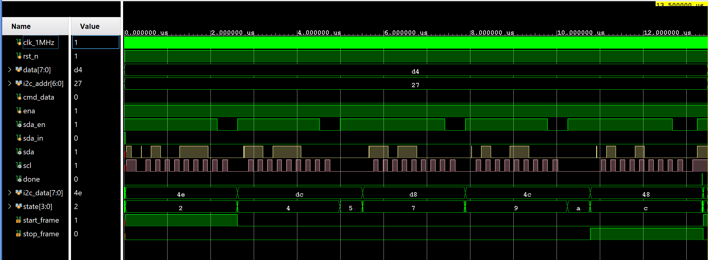

### [4. lcd_display](./src/lcd_display.v)

---

Input gồm **row1** và **row2** là chuỗi ký tự cần hiển thị trên dòng 1 và dòng 2. Mỗi dòng 16 ký tự x 8 bit = 128 bit.

Cần chú ý đoạn code **genvar** nhằm chuyển dữ liệu từ **row1**, **row2** vào mảng **cmd_data_array** (40 byte). Mảng này chứa các lệnh cần ghi vào LCD:
1. Lệnh **0 -> 5**:  các lệnh khởi tạo LCD.
2. Lệnh **6 -> 21**: dữ liệu của dòng 1.
3. Lệnh **22**: chuyển con trỏ xuống đầu dòng 2.
4. Lệnh **23 -> 38**: dữ liệu của dòng 2.

[Testbench code](./tb/lcd_display_tb.v)

Testbench waveform:

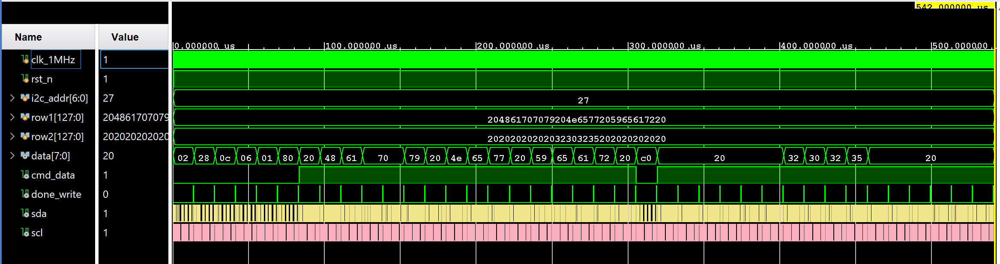

### [5. top](./src/top.v)

---

Kết nối các module con lại, gán dữ liệu **row1** và **row2** cần hiển thị.

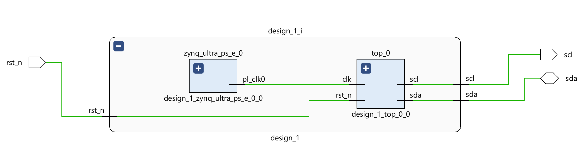
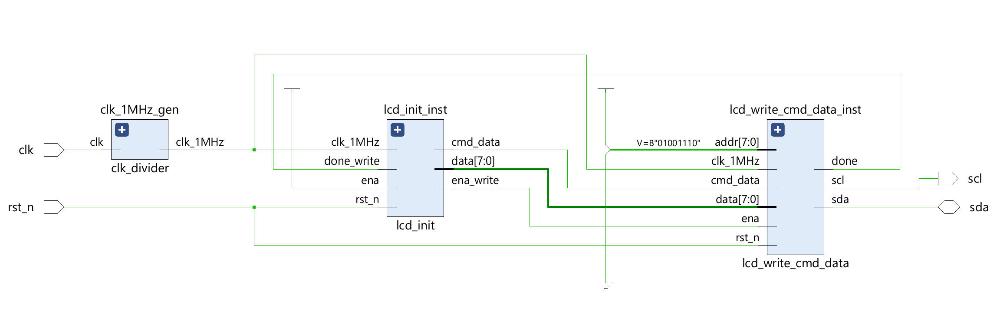

## VI. Tham khảo

1. [i2c_protocol](https://dayhocstem.com/blog/2020/05/giao-dien-ghep-noi-i2c.html)
2. [lcd_4bit_mode](https://www.electronicwings.com/8051/lcd16x2-interfacing-in-4-bit-mode-with-8051)
3. [lcd_i2c_module](https://blog.csdn.net/qq_41795958/article/details/113649456)
4. [lcd_i2c_project](https://blog.csdn.net/xyx0610/article/details/121715973)
